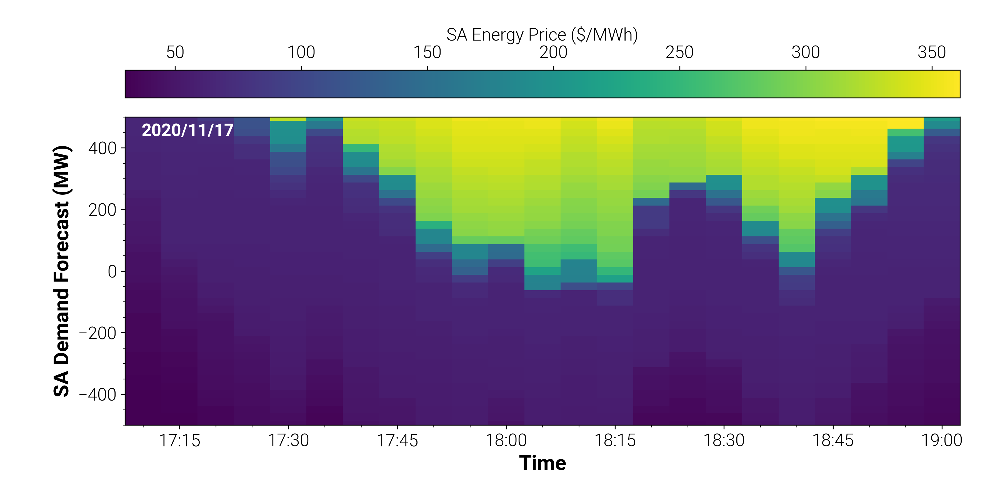
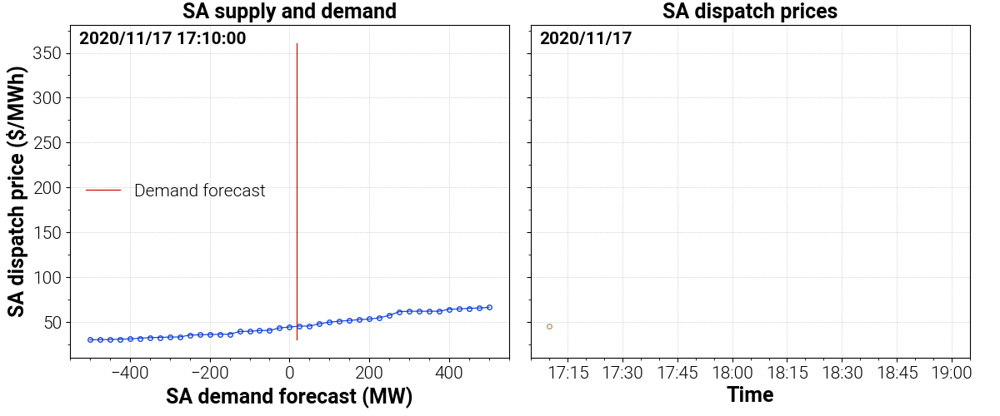
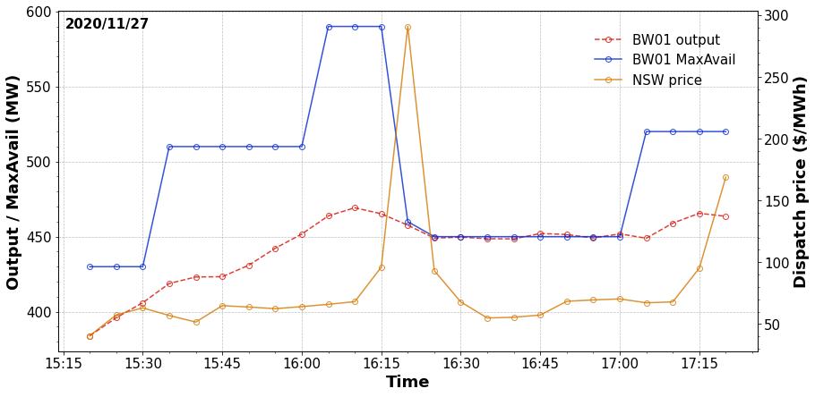

# Case studies

## Price volatility 
The Dispatch API is used to investigate the underlying causes for a period of volatile dispatch prices in South Australia. [Click here](price-volatility/price-volatility.ipynb).

<!--  -->

## Rebid analysis
Changing plant / system conditions often require traders to rebid a generator or load's availability. The following case study uses the Dispatch API to estimate the impact a rebid has on spot prices. [Click here](rebid-analysis/rebid-analysis.ipynb).

