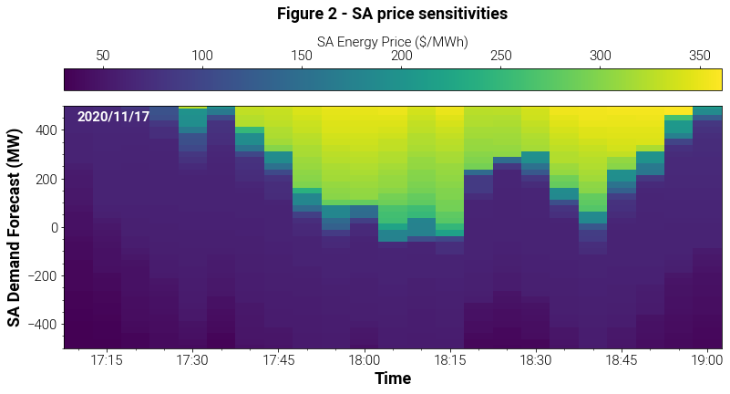

# Price volatility

## Overview
Over the span of two hours on 17 November 2020 South Australian dispatch prices increased from 45 $/MWh to over 250 $/MWh before falling to 62 $/MWh. The following analysis uses the Dispatch API to explore the underlying factors responsible for this price volatility.

## Analysis
Dispatch prices for the period under investigation are shown in Figure 1. When examining the historical price series from 5.10pm to 5.45pm there appears be no indication that South Australian dispatch prices are on the verge of experiencing significant volatility over the following hour. Were the price movements from 5.50pm to 6.45pm due to a contingency event, or were there changes occurring to system dynamics in the lead up to 5.50pm that only began to be reflected in prices at 5.55pm? Sensitivity analyses can assist in answering these questions by estimating the prices that would be realised under different operating scenarios.

    

    

Understanding the relationship between demand and dispatch prices is particularly important as it can help exposit underlying dynamics relating to changes in the system's state. The Dispatch API is used to investigate this relationship by incrementally augmenting the Demand Forecast (DF) parameter for each dispatch interval and observing the resulting dispatch price. The DF parameter corresponds to the amount by which demand is expected to change over a dispatch interval. For example, a value of 10 MW denotes that demand is expected to be 10 MW higher at the end of a dispatch interval relative to the start of the interval. 

Scenarios are constructed by varying the DF parameter from -500MW to 500MW at 25 MW incremenets for each interval from 5.10pm to 7.00pm, with the results shown in Figure 2. Each dispatch interval is represented by a column comprised of rectangles. Each rectangle represents a demand forecast scenario, with the colour of the rectangle denoting the price observed for the scenario - lighter colours correspond to higher prices. These columns illustrate the relationship between demand and dispatch prices for each interval.

    

    

Overlaying the historical price series and realised demand forecast values in Figure 3 we can see how these price sensitivities change over the window under investigation. From 5.10pm to 6.05pm there is a downward shift in lighter coloured rectangles - the system is moving closer to a region where higher prices are likely to be observed. The DF parameter is typically in the order of 10's of MW, as shown by the red curve which denotes historical DF parameters observed for each interval. The intersection of the historical DF curve and colour of the rectangle it passes through corresponds to the historical price observed for that dispatch interval. The red curve begins in a dark blue rectangle indicating a relatively low price, but then intersects lighter coloured rectangles during the period of price volatility. By running scenarios over a wide range of demand forecast parameters we are forewarned of the price increase as we can see the lighter coloured rectangles approaching the red curve from 5.10pm to 5.55pm.

    

    

The price dynamics observed between 5.10pm and 5.55pm are analogous to walking near the edge of a cliff - the ground is flat until reaching the precipice. Similarly, prices remain relatively steady until reaching a critical level at which point they quickly increase. If we simply look at a historical prices we are walking with our eyes closed. By running scenarios with different DF parameters we are able to see our surroundings, in particular the location of the cliff's edge.

Attention now turns to identifying drivers of the price volatility observed from 5.55pm to 6.45pm. Examining demand and supply over the window under investigation is a natural starting point. The amount by which demand and semi-scheduled output change over the window under investigation is shown in Figure 4. Plotted values denote the change observed relative to 5.10pm. Demand is approximatley 300 MW higher at the end of the window relative to the start, while semi-scheduled output has fallen by a similar amount. For reference, total demand in South Australia is 1086 MW at 5.10pm.  This rapid increase in demand coupled with a reduction in supply results in a move up the supply curve, illustrated by the downward movement of yellow and green rectangles from 5.10pm to 6.05pm in Figure 3.

    

    

Net generation and demand relative to the start of the window under investigation can also be compared, with Figure 5 showing regional demand outpacing net generation.

    

    

The following animation illustrates how prices become more sensitive to changes in demand before price volatility materialises. At 5.55pm demand intersects within a steep section of the supply curve, resulting in a sudden price increase. Note the supply curve has been constructed using the same information found in Figure 3.

Gradual shifts in the supply curve from 5.10pm to 5.55pm, coupled with the rapid increase in demand and reduction in output from semi-scheduled plant provides preliminary evidence suggesting demand and supply dynamics are the primary drivers of the price volatility observed. The impact of interconnector capabilities, generator availabilities, and generic constraints on South Australian dispatch prices could also be assessed, but is beyond the scope of this analysis.

## Summary
The Dispatch API allows otherwise unobservable relationships between system parameters and dispatch outcomes to be investigated. While this analysis has examined how changes to demand in South Australia affect dispatch prices in the same region, the Dispatch API can also be used to explore how other parameters such as interconnector capabilities, generator availabilities, or output from wind and solar plant impact dispatch outcomes.
