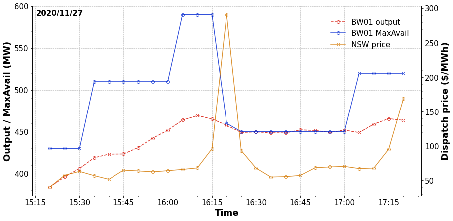

# Rebid Analysis
The following sections demonstrate how the NEMDE API can be used estimate the contribution of a rebid to a change in dispatch prices.

## Overview
On 27 November 2020 at 4.15pm the dispatch price in NSW was approximately 96 $/MWh. Dispatch prices increased to 290 $/MWh in the following interval at 4.20pm before falling to 93 $/MWh at 4.25pm. Approximately 2 minutes before the interval in which the price spike occurred a unit at Bayswater power station (trader ID BW01) submitted a rebid which indicated the unit's max available capacity was 130 MW less than previously anticipated. The following figure plots the power output and max availability for this unit, along with NSW dispatch prices.


    

    


When analysing historical data it is difficult to estimate the extent to which a change in max availbility for BW01 contributed to the price movement at 4.20pm. The NEMDE API addresses this limitation by allowing users to estimate dispatch outcomes under counterfactual scenarios. For instance, a scenario can be constructed in which BW01 does not reduce its max availability at 4.20pm. Dispatch prices for this scenario can then be compared to historical outputs. As all other system parameters are kept constant, it is possible to isolate the rebid's contribution to the change in dispatch prices.

## Aims and scope
The following analysis investigates how the rebid submitted by BW01 impacted dispatch prices observed at 4.20pm on 27 Novermber 2020. First, model validation is undertaken to assess the NEMDE API's ability to emulate NEMDE outputs for the interval under investigation. If close correspondence is observed between NEMDE API and NEMDE solutions then counterfactual scenarios will be constructed to estimate dispatch prices that would have arisen if BW01 had not rebid its capacity. 

## Validation
Historical NEMDE case files include the outputs returned by NEMDE when run for a given set of inputs describing the NEM's state. Model validation is performed by passing the same parameters to the NEMDE API as were passed to NEMDE, and comparing the NEMDE API's solution to historical NEMDE outputs. The degree to which solutions obtained from the NEMDE API correspond with NEMDE outputs indicates the NEMDE API's ability to emulate NEMDE for the dispatch interval under investigation. If close correspondence between the two solutions is observed then it is appropriate to proceed with the counterfactual scenario analysis.

The following sections summarise the difference between the results obtained from the NEMDE API and historical NEMDE outputs for the dispatch interval ending at 4.20pm on 27 November 2020 - the interval for which the price spike is observed. 

### Trader solution
Summary statistics are computed for the difference between the NEMDE API's solution and NEMDE outputs, with the difference defined as follows: 

```
Solution Difference = NEMDE API Solution - NEMDE Solution.
```

Statistics for the difference between the trader solution obtained from the NEMDE API and NEMDE are shown below.


| key             |   count |         mean |         std |          min |   25% |   50% |   75% |         max |
|:----------------|--------:|-------------:|------------:|-------------:|------:|------:|------:|------------:|
| @EnergyTarget   |     340 |  4.92941e-08 | 1.20878e-06 |  -4.24e-06   |     0 |     0 |     0 |  2e-05      |
| @FSTargetMode   |      74 |  0.0135135   | 0.116248    |   0          |     0 |     0 |     0 |  1          |
| @L5RegTarget    |     340 |  8.82353e-10 | 1.69762e-07 |  -2e-06      |     0 |     0 |     0 |  2.4e-06    |
| @L5RegViolation |     340 |  0           | 0           |   0          |     0 |     0 |     0 |  0          |
| @L5Target       |     340 |  5.22458e-18 | 3.84048e-07 |  -5e-06      |     0 |     0 |     0 |  5e-06      |
| @L5Violation    |     340 |  0           | 0           |   0          |     0 |     0 |     0 |  0          |
| @L60Target      |     340 |  5.88235e-09 | 2.42822e-07 |  -2e-06      |     0 |     0 |     0 |  4e-06      |
| @L60Violation   |     340 |  0           | 0           |   0          |     0 |     0 |     0 |  0          |
| @L6Target       |     340 |  4.11765e-09 | 1.51806     | -20          |     0 |     0 |     0 | 17.9348     |
| @L6Violation    |     340 |  0           | 0           |   0          |     0 |     0 |     0 |  0          |
| @R5RegTarget    |     340 |  6.47059e-10 | 1.16308e-07 |  -1.6e-06    |     0 |     0 |     0 |  1.34e-06   |
| @R5RegViolation |     340 |  0           | 0           |   0          |     0 |     0 |     0 |  0          |
| @R5Target       |     340 | -1.55882e-08 | 2.27902e-07 |  -4e-06      |     0 |     0 |     0 |  0          |
| @R5Violation    |     340 |  0           | 0           |   0          |     0 |     0 |     0 |  0          |
| @R60Target      |     340 |  2.05882e-08 | 0.397291    |  -5.17241    |     0 |     0 |     0 |  5.17241    |
| @R60Violation   |     340 |  0           | 0           |   0          |     0 |     0 |     0 |  0          |
| @R6Target       |     340 | -8.52941e-09 | 3.7803e-07  |  -3.3e-06    |     0 |     0 |     0 |  5e-06      |
| @R6Violation    |     340 |  0           | 0           |   0          |     0 |     0 |     0 |  0          |
| @RampDnRate     |     325 | -0.000115572 | 0.000664364 |  -0.00499714 |     0 |     0 |     0 |  0.00286621 |
| @RampUpRate     |     325 | -0.000129432 | 0.000710994 |  -0.00499714 |     0 |     0 |     0 |  0.00229698 |


The following figures visualise the correspondence between the dispatch targets obtained from the NEMDE API and those returned by NEMDE for each trade type. Each point represents a dispatch target for a given trader. The horizontal axis denotes the solution obtained from the NEMDE API, while the vertical axis denotes the solution obtained from NEMDE. The dashed line has a slope of one, and indicates perfect correspondence between the NEMDE API and NEMDE solutions.


    

    


There is excellent correpondence between the two models with respect to dispatch targets. The symmetric dispersion of points around the dashed line for the L6Target is likely due to the absence of tie-breaking constraints for FCAS offers.

### Region solution
Summary statistics are presented for region solution metrics.


| key                   |   count |         mean |         std |          min |          25% |          50% |        75% |         max |
|:----------------------|--------:|-------------:|------------:|-------------:|-------------:|-------------:|-----------:|------------:|
| @ClearedDemand        |       5 |  0.00134777  |  0.00385127 |  -0.00432637 | -0.000960905 |  0.00368311  | 0.00372296 |  0.00462005 |
| @DispatchedGeneration |       5 | -0.000654648 |  0.002728   |  -0.004063   | -0.0026      | -0.00066124  | 0.002015   |  0.002036   |
| @DispatchedLoad       |       5 |  0           |  0          |   0          |  0           |  0           | 0          |  0          |
| @EnergyPrice          |       5 |  5.38e-05    |  0.0001203  |   0          |  0           |  0           | 0          |  0.000269   |
| @FixedDemand          |       5 | -0.000361337 |  0.00269196 |  -0.00409289 | -0.00115808  | -0.000441503 | 0.00056413 |  0.00332166 |
| @L5Dispatch           |       5 |  0.00078     |  0.00216607 |  -0.000715   |  0           |  0           | 0          |  0.004615   |
| @L5RegDispatch        |       5 |  6e-08       |  0.00312693 |  -0.004422   |  0           |  0           | 0          |  0.0044223  |
| @L60Dispatch          |       5 | -0.0006936   |  0.00155094 |  -0.003468   |  0           |  0           | 0          |  0          |
| @L6Dispatch           |       5 | -0.00069372  | 15.8944     | -20          | -4.33        |  0           | 0          | 24.3265     |
| @NetExport            |       5 | -0.000290892 |  0.00397442 |  -0.00463117 | -0.003894    | -0.000218443 | 0.00320717 |  0.00408198 |
| @R5Dispatch           |       5 |  0.00100694  |  0.00162969 |   0          |  0           |  0           | 0.0012887  |  0.003746   |
| @R5RegDispatch        |       5 | -0.00199996  |  0.00238176 |  -0.00499952 | -0.0041116   | -0.00088866  | 0          |  0          |
| @R60Dispatch          |       5 |  0.0015334   |  0.00160367 |   0          |  0           |  0.0012887   | 0.003045   |  0.0033333  |
| @R6Dispatch           |       5 |  0.00153342  |  0.0016037  |   0          |  0           |  0.0012887   | 0.003045   |  0.0033334  |
| @SurplusGeneration    |       5 |  0           |  0          |   0          |  0           |  0           | 0          |  0          |


There is good correspondence with respect to energy prices for the two models - an important requirement if seeking to estimate the contribution of a rebid to a change in dispatch prices.

### Interconnector solution
Summary statistics are also presented for interconnector solution metrics.


| key      |   count |         mean |         std |    min |        25% |      50% |       75% |     max |
|:---------|--------:|-------------:|------------:|-------:|-----------:|---------:|----------:|--------:|
| @Deficit |       6 |  0           | 0           |  0     |  0         |  0       | 0         | 0       |
| @Flow    |       6 |  1.66667e-06 | 4.08248e-06 |  0     |  0         |  0       | 0         | 1e-05   |
| @Losses  |       6 | -1.66667e-07 | 3.14494e-06 | -4e-06 | -2.625e-06 | -2.5e-07 | 2.425e-06 | 3.6e-06 |


### Validation summary
Close correpsondence is observed between the NEMDE API's solution and outputs obtained from NEMDE, suggesting it is appropriate to undertake counterfactual scenario analysis for the interval in question.

## Contribution of rebid to region price change
The bid for BW01 at 4.15pm is compared with the bid at 4.20pm in the following table.


|             |   2020-11-27 16:15:00 |   2020-11-27 16:20:00 |   Difference (MW) |
|:------------|----------------------:|----------------------:|------------------:|
| MAXAVAIL    |                   590 |                   460 |              -130 |
| BANDAVAIL1  |                   330 |                   330 |                 0 |
| BANDAVAIL2  |                     0 |                     0 |                 0 |
| BANDAVAIL3  |                     0 |                     0 |                 0 |
| BANDAVAIL4  |                   330 |                   330 |                 0 |
| BANDAVAIL5  |                     0 |                     0 |                 0 |
| BANDAVAIL6  |                     0 |                     0 |                 0 |
| BANDAVAIL7  |                     0 |                     0 |                 0 |
| BANDAVAIL8  |                     0 |                     0 |                 0 |
| BANDAVAIL9  |                    40 |                    40 |                 0 |
| BANDAVAIL10 |                     0 |                     0 |                 0 |


The case file corresponding to the 4.20pm dispatch interval is updated such that the bid for BW01 applying at 4.15pm also applies at 4.20pm (the MaxAvail parameter for BW01 is set to 590MW for the 4.20pm case file). The NEMDE API is used to run the augmented case file, with region solution metrics corresponding to this scenario shown in the following table.


| @RegionID   |   @EnergyPrice |   @DispatchedGeneration |   @DispatchedLoad |   @FixedDemand |   @NetExport |   @SurplusGeneration |   @R6Dispatch |   @R60Dispatch |   @R5Dispatch |   @R5RegDispatch |   @L6Dispatch |   @L60Dispatch |   @L5Dispatch |   @L5RegDispatch |   @ClearedDemand |
|:------------|---------------:|------------------------:|------------------:|---------------:|-------------:|---------------------:|--------------:|---------------:|--------------:|-----------------:|--------------:|---------------:|--------------:|-----------------:|-----------------:|
| NSW1        |       288.246  |                 9184.13 |                 0 |        9820.01 |     -635.875 |                    0 |      183      |       129      |       92      |          40.125  |        1      |        61      |       51.9093 |          35.3844 |          9808.92 |
| QLD1        |       278.971  |                 7879.54 |                 0 |        7538.32 |      341.223 |                    0 |       72.3333 |        28.3333 |       49.2037 |          47.5659 |        5      |         5      |        5      |          25      |          7537.47 |
| SA1         |       329.865  |                 1922.82 |                 0 |        2315.5  |     -392.685 |                    0 |      155      |       170      |      103      |         198      |      175      |       106      |       90      |          50      |          2319.48 |
| TAS1        |        75.5221 |                 1523.41 |                 0 |        1090.25 |      433.166 |                    0 |       14.603  |        14.603  |        0      |           0      |       24.3265 |        72.0265 |       50.3846 |          50      |          1106.66 |
| VIC1        |       299.5    |                 7223.44 |                10 |        6930.94 |      282.501 |                    0 |      112.241  |       195.241  |       79.2413 |          64.3091 |       15      |        82      |       55      |          49.6156 |          6960.81 |


The NEMDE API is then used to run the base case scenario in which no changes are made to the historical case file. Note excellent correspondence was observed between NEMDE and NEMDE API energy prices in the model validation section. Region solution results for the base case are shown below.


| @RegionID   |   @EnergyPrice |   @DispatchedGeneration |   @DispatchedLoad |   @FixedDemand |   @NetExport |   @SurplusGeneration |   @R6Dispatch |   @R60Dispatch |   @R5Dispatch |   @R5RegDispatch |   @L6Dispatch |   @L60Dispatch |   @L5Dispatch |   @L5RegDispatch |   @ClearedDemand |
|:------------|---------------:|------------------------:|------------------:|---------------:|-------------:|---------------------:|--------------:|---------------:|--------------:|-----------------:|--------------:|---------------:|--------------:|-----------------:|-----------------:|
| NSW1        |       290.951  |                 9171.51 |                 0 |        9820.01 |     -648.5   |                    0 |      183      |       129      |       92      |          40.125  |        1      |        61      |       51.9093 |          35.3844 |          9808.69 |
| QLD1        |       281.589  |                 7879.54 |                 0 |        7538.32 |      341.223 |                    0 |       72.3333 |        28.3333 |       49.2037 |          47.5659 |        5      |         5      |        5      |          25      |          7537.47 |
| SA1         |       329.865  |                 1922.82 |                 0 |        2315.5  |     -392.685 |                    0 |      155      |       170      |      103      |         198      |      175      |       106      |       90      |          50      |          2319.48 |
| TAS1        |        73.1068 |                 1523.41 |                 0 |        1090.25 |      433.166 |                    0 |       14.603  |        14.603  |        0      |           0      |       24.3265 |        72.0265 |       50.3846 |          50      |          1106.66 |
| VIC1        |       299.5    |                 7235.69 |                10 |        6930.94 |      294.744 |                    0 |      112.241  |       195.241  |       79.2413 |          64.3091 |       15      |        82      |       55      |          49.6156 |          6960.66 |


The difference between the counterfactual scenario and the base case is as follows.


| @RegionID   |   @EnergyPrice |   @DispatchedGeneration |   @DispatchedLoad |   @FixedDemand |   @NetExport |   @SurplusGeneration |   @R6Dispatch |   @R60Dispatch |   @R5Dispatch |   @R5RegDispatch |   @L6Dispatch |   @L60Dispatch |   @L5Dispatch |   @L5RegDispatch |   @ClearedDemand |
|:------------|---------------:|------------------------:|------------------:|---------------:|-------------:|---------------------:|--------------:|---------------:|--------------:|-----------------:|--------------:|---------------:|--------------:|-----------------:|-----------------:|
| NSW1        |       -2.7049  |                 12.625  |                 0 |              0 |      12.625  |                    0 |             0 |              0 |             0 |                0 |             0 |              0 |             0 |                0 |         0.225084 |
| QLD1        |       -2.61786 |                  0      |                 0 |              0 |       0      |                    0 |             0 |              0 |             0 |                0 |             0 |              0 |             0 |                0 |         0        |
| SA1         |        0       |                  0      |                 0 |              0 |       0      |                    0 |             0 |              0 |             0 |                0 |             0 |              0 |             0 |                0 |         0        |
| TAS1        |        2.41522 |                  0      |                 0 |              0 |       0      |                    0 |             0 |              0 |             0 |                0 |             0 |              0 |             0 |                0 |         0        |
| VIC1        |        0       |                -12.2435 |                 0 |              0 |     -12.2435 |                    0 |             0 |              0 |             0 |                0 |             0 |              0 |             0 |                0 |         0.156414 |


The analysis suggests the rebid led to slightly higher prices in New South Wales and Queensland, but reduced prices in Tasmania. These price differences are small relative to the magnitude of the price spike, suggesting the rebid made by BW01 was not a determinative factor in the large price change observed.

## Summary
The NEMDE API has been used to estimate dispatch prices that would arise if BW01 had not rebid its max availability. Model validation is first performed to assess the NEMDE API's ability to emulate NEMDE outputs for the dispatch interval in question, with close correspondence between the NEMDE API's solution and NEMDE outputs observed. A counterfactual scenario is then constructed which assumes no reduction in max availablity for BW01 at 4.20pm. This scenario is compared with the base case in which BW01 does rebid its capacity, with the results suggesting the rebid has a negligible impact on prices at 4:20pm - it is likely other factors, unrelated to the rebid submitted by BW01, are driving the price movement in this dispatch interval.
