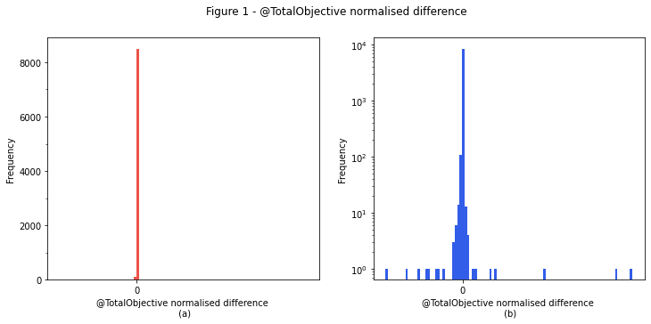
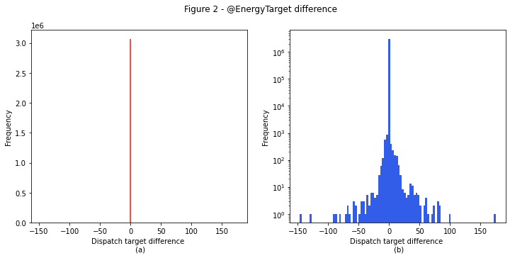

# Model validation

Historical NEMDE case files contain the inputs passed to the NEMDE, along with the outputs (dispatch targets and prices) returned by the program. Backtesting involves passing these same data to the Dispatch API's model and then comparing the outputs to those returned by the NEMDE. The degree to which the Dispatch API's solutions correspond to NEMDE outputs gives an indication as to the model's accuracy - the smaller the difference, the more accurate the approximation.

## Sample

Backtests are performed for all dispatch intervals between 2021-04-01 4:05:00 and 2021-05-01 4:00:00 (8640 dispatch intervals in total). 

## Metrics

Unless otherwise specified, summary statistics are computed for the difference between the Dispatch API's solution and NEMDE outputs, with the solution difference given by the following formula

```
Solution difference = Model solution - NEMDE solution.
```


Tables presenting summary statistics consist of columns corresponding to the key for which the solution difference has been computed, while rows display different metrics, the definitions of which are given in the following table:

| Name | Description |
| :--- | :---------- |
| count | Sample size |
| mean | Mean value |
| std | Standard deviation |
| min | Minimum value in sample |
| X % | X percentile |
| max | Maxiumum value in sample |


The raw data used to generate the following summary statistics can be downloaded [here](https://storage.googleapis.com/dispatch-api-backtest-results/1a982d7df8454ee8905b9c09c3eeb27f.zip).

### Period solution
Summary statistics for aggregate constraint violations and objective function values are shown in the following table.


|       |   @TotalFastStartViolation |   @TotalGenericViolation |   @TotalInterconnectorViolation |   @TotalMNSPCapacityViolation |   @TotalMNSPOfferViolation |   @TotalMNSPRampRateViolation |   @TotalObjective |   @TotalRampRateViolation |   @TotalUIGFViolation |   @TotalUnitMWCapacityViolation |
|:------|---------------------------:|-------------------------:|--------------------------------:|------------------------------:|---------------------------:|------------------------------:|------------------:|--------------------------:|----------------------:|--------------------------------:|
| count |             8640           |           8640           |                            8640 |                          8640 |                       8640 |                          8640 |        8640       |            8640           |        8640           |                  8640           |
| mean  |               -5.78704e-10 |             -0.000230032 |                               0 |                             0 |                          0 |                             0 |          -5.24741 |              -2.87037e-08 |          -4.6573e-07  |                    -1.49676e-06 |
| std   |                3.87875e-08 |              0.0213337   |                               0 |                             0 |                          0 |                             0 |         804.892   |               2.66806e-06 |           5.65038e-05 |                     0.000107749 |
| min   |               -3e-06       |             -1.983       |                               0 |                             0 |                          0 |                             0 |       -8196.99    |              -0.000248    |          -0.0005      |                    -0.0005      |
| 0.1%  |                0           |             -0.000482083 |                               0 |                             0 |                          0 |                             0 |         -46.2393  |               0           |          -0.000494    |                    -0.000499    |
| 1%    |                0           |             -1.8e-05     |                               0 |                             0 |                          0 |                             0 |         -34.3667  |               0           |          -0.00025     |                    -0.000440561 |
| 10%   |                0           |              0           |                               0 |                             0 |                          0 |                             0 |         -20.0326  |               0           |           0           |                    -8e-06       |
| 25%   |                0           |              0           |                               0 |                             0 |                          0 |                             0 |         -17.5938  |               0           |           0           |                    -3.59e-06    |
| 50%   |                0           |              0           |                               0 |                             0 |                          0 |                             0 |         -15.3853  |               0           |           0           |                     0           |
| 75%   |                0           |              0           |                               0 |                             0 |                          0 |                             0 |         -13.1249  |               0           |           0           |                     0           |
| 90%   |                0           |              0           |                               0 |                             0 |                          0 |                             0 |         -11.3609  |               0           |           0           |                     8e-06       |
| 99%   |                0           |              1.2122e-05  |                               0 |                             0 |                          0 |                             0 |           7.45146 |               0           |           0.0002439   |                     0.000426899 |
| 99.9% |                0           |              0.000423971 |                               0 |                             0 |                          0 |                             0 |         706.385   |               0           |           0.000493936 |                     0.000494574 |
| max   |                0           |              0.0004973   |                               0 |                             0 |                          0 |                             0 |       74021.6     |               0           |           0.0005      |                     0.00050146  |


The `@TotalObjective` metric is of particular interest. Small perturbations to input parameters or constraint formulations can lead to large changes in the objective function's value at optimality. As there can be considerable variability with respect to the magnitude of this metric additional context is provided by normalising the difference using the following formula:

`Normalised Difference = (Dispatch API Total Objective - NEMDE Total Objective) / NEMDE Total Objective`.

Summary statistics for this normalised metric are shown below:


|       |   @TotalObjectiveNormalisedDifference |
|:------|--------------------------------------:|
| count |                        8640           |
| mean  |                           8.7459e-07  |
| std   |                           2.13632e-05 |
| min   |                          -0.000545912 |
| 0.1%  |                          -6.55193e-05 |
| 1%    |                          -3.78768e-06 |
| 10%   |                          -3.54142e-07 |
| 25%   |                          -4.97563e-08 |
| 50%   |                           1.04533e-06 |
| 75%   |                           1.38992e-06 |
| 90%   |                           1.74495e-06 |
| 99%   |                           6.26676e-06 |
| 99.9% |                           4.17993e-05 |
| max   |                           0.00120749  |


The mean relative difference is 0.000087%, suggesting excellent correspondence for a vast majority of the dispatch intervals investigated. 

The following histograms plot the normalised difference.

    /home/compo/miniconda3/envs/dispatch-api-tutorials/lib/python3.9/site-packages/pandas/plotting/_matplotlib/tools.py:400: MatplotlibDeprecationWarning: 
    The is_first_col function was deprecated in Matplotlib 3.4 and will be removed two minor releases later. Use ax.get_subplotspec().is_first_col() instead.
      if ax.is_first_col():


    

    


### Regions
The difference between region solutions obtained from the Dispatch API and NEMDE are shown in the following table:


|       |   @ClearedDemand |   @DispatchedGeneration |   @DispatchedLoad |   @EnergyPrice |    @FixedDemand |    @L5Dispatch |   @L5RegDispatch |   @L60Dispatch |    @L6Dispatch |      @NetExport |   @R5Dispatch |   @R5RegDispatch |    @R60Dispatch |     @R6Dispatch |   @SurplusGeneration |
|:------|-----------------:|------------------------:|------------------:|---------------:|----------------:|---------------:|-----------------:|---------------:|---------------:|----------------:|--------------:|-----------------:|----------------:|----------------:|---------------------:|
| count |  43200           |          43200          |   43200           | 43200          | 43200           | 43200          |  43200           | 43200          | 43200          | 43200           |  43200        |  43200           | 43200           | 43200           |                43200 |
| mean  |     -0.00726389  |             -0.00724513 |       0.000256479 |    -0.0549102  |    -1.28787e-05 |    -0.0469272  |      7.34422e-06 |    -0.0928329  |    -0.0659896  |    -0.0075605   |     -0.181868 |     -0.000211147 |    -0.0129342   |     0.000143315 |                    0 |
| std   |      0.230423    |              3.11459    |       0.0441242   |     4.28704    |     0.00288432  |     1.5733     |      0.742168    |     1.95298    |     7.22621    |     3.12331     |      5.11396  |      0.771209    |     3.09734     |     1.77893     |                    0 |
| min   |    -15.8901      |           -170.276      |      -5           |  -576.211      |    -0.00499998  |   -72          |    -40           |   -62          |   -70          |  -170.278       |   -117        |    -33           |   -84           |   -46           |                    0 |
| 0.1%  |     -2.89466     |            -20.0235     |      -0.00360901  |    -6.61755    |    -0.00499061  |   -21.0438     |     -9           |   -43.801      |   -40.0042     |   -21.1914      |    -65.0777   |     -9.40064     |   -30.9064      |   -18.9885      |                    0 |
| 1%    |     -0.0049563   |             -0.00497    |       0           |    -0.00136307 |    -0.0049087   |    -1.71042    |     -0.00499952  |    -0.00487    |   -25          |    -0.00492488  |    -10.0038   |     -0.0049756   |    -9.99378     |    -3           |                    0 |
| 10%   |     -0.00404488  |             -0.004      |       0           |    -2.23e-05   |    -0.00399141  |    -0.0016932  |     -2e-06       |    -0.0019     |    -0.004616   |    -0.003945    |     -0.003317 |     -0.00089856  |    -0.0039411   |    -0.0033334   |                    0 |
| 25%   |     -0.00249697  |             -0.00248    |       0           |    -1e-06      |    -0.0025206   |     0          |      0           |     0          |     0          |    -0.00230016  |      0        |      0           |    -0.000548    |     0           |                    0 |
| 50%   |      3.69658e-05 |              4.335e-05  |       0           |     0          |    -1.47997e-05 |     0          |      0           |     0          |     0          |    -5.52071e-05 |      0        |      0           |     0           |     0           |                    0 |
| 75%   |      0.00255456  |              0.00259803 |       0           |     4e-06      |     0.00246805  |     0          |      0           |     0          |     0          |     0.00244     |      0        |      0           |     0.000228425 |     0           |                    0 |
| 90%   |      0.00409419  |              0.00406955 |       0           |     0.00024791 |     0.00399658  |     0.00149863 |      2e-06       |     0.00201015 |     0.00416214 |     0.00401877  |      0.003097 |      0.0007324   |     0.003333    |     0.0031746   |                    0 |
| 99%   |      0.00594889  |              0.00553584 |       0           |     0.00150106 |     0.00490659  |     0.796617   |      0.005       |     0.0048288  |    29.6966     |     0.00627672  |     10        |      0.0049268   |     8.96169     |     2.22        |                    0 |
| 99.9% |      0.307791    |             18.8761     |       0.00317649  |     0.0632088  |     0.00499133  |     9.25666    |      9           |     0.005      |    49.5024     |    18.8804      |     39        |      9.5         |    30.0037      |    23.9121      |                    0 |
| max   |      8.62209     |            205.594      |       5           |    85.3612     |     0.00499974  |    23          |     55           |    23.16       |    70          |   205.593       |    100        |     33           |    50.5         |    46.0023      |                    0 |


### Interconnectors

Summary statistics for the difference between interconnector solutions obtained from the Dispatch API and NEMDE outputs are shown in the following table:


|       |   @Deficit |        @Flow |        @Losses |
|:------|-----------:|-------------:|---------------:|
| count |      51840 | 51840        | 51840          |
| mean  |          0 |     0.043914 |    -0.00630429 |
| std   |          0 |     3.57264  |     0.340097   |
| min   |          0 |  -188.532    |   -27.7887     |
| 0.1%  |          0 |    -9.47514  |    -2.74303    |
| 1%    |          0 |    -1e-05    |    -5e-06      |
| 10%   |          0 |     0        |    -4e-06      |
| 25%   |          0 |     0        |    -2.5e-06    |
| 50%   |          0 |     0        |     0          |
| 75%   |          0 |     0        |     2.2625e-06 |
| 90%   |          0 |     0        |     3.95e-06   |
| 99%   |          0 |     1e-05    |     0.00911366 |
| 99.9% |          0 |    29.9524   |     0.401957   |
| max   |          0 |   215.551    |    22.8728     |


### Traders

Summary statistics for the difference between trader solutions obtained from the Dispatch API and outputs reported by the NEMDE are shown below:


|       |   @EnergyTarget |   @FSTargetMode |   @L5RegTarget |   @L5RegViolation |      @L5Target |   @L5Violation |    @L60Target |   @L60Violation |      @L6Target |   @L6Violation |   @R5RegTarget |   @R5RegViolation |     @R5Target |   @R5Violation |    @R60Target |   @R60Violation |     @R6Target |   @R6Violation |   @RampDnRate |   @RampUpRate |
|:------|----------------:|----------------:|---------------:|------------------:|---------------:|---------------:|--------------:|----------------:|---------------:|---------------:|---------------:|------------------:|--------------:|---------------:|--------------:|----------------:|--------------:|---------------:|--------------:|--------------:|
| count |     3.0648e+06  | 630694          |    3.0648e+06  |        3.0648e+06 |    3.0648e+06  |     3.0648e+06 |    3.0648e+06 |      3.0648e+06 |    3.0648e+06  |     3.0648e+06 |    3.0648e+06  |        3.0648e+06 |    3.0648e+06 |     3.0648e+06 |   3.0648e+06  |      3.0648e+06 |   3.0648e+06  |     3.0648e+06 |   2.90928e+06 |   2.90928e+06 |
| mean  |    -9.88134e-05 |      0.00117965 |   -1.03417e-09 |        0          |   -0.000661336 |     0          |   -0.00130888 |      0          |   -0.000930919 |     0          |   -2.73462e-06 |        0          |   -0.00256321 |     0          |  -0.000180932 |      0          |   2.43402e-06 |     0          |  -0.000100076 |  -9.80774e-05 |
| std   |     0.390342    |      0.166714   |    0.310275    |        0          |    0.795769    |     0          |    1.1752     |      0          |    1.06659     |     0          |    0.31334     |        0          |    1.25552    |     0          |   0.722973    |      0          |   0.591007    |     0          |   0.000727775 |   0.0007142   |
| min   |  -146.461       |     -4          |  -50.0001      |        0          | -116.757       |     0          | -124.716      |      0          | -115.321       |     0          |  -36.707       |        0          | -107.657      |     0          | -92.4525      |      0          | -33           |     0          |  -0.005       |  -0.005       |
| 0.1%  |    -7.12462e-06 |     -1          |   -2           |        0          |   -3.93637     |     0          |   -6.73891    |      0          |  -14           |     0          |   -1.34313     |        0          |  -13.4952     |     0          |  -5.71423     |      0          |  -5           |     0          |  -0.00499993  |  -0.00499993  |
| 1%    |    -1.1e-06     |      0          |    0           |        0          |    0           |     0          |    0          |      0          |    0           |     0          |    0           |        0          |    0          |     0          |   0           |      0          |   0           |     0          |  -0.00372711  |  -0.00372711  |
| 10%   |     0           |      0          |    0           |        0          |    0           |     0          |    0          |      0          |    0           |     0          |    0           |        0          |    0          |     0          |   0           |      0          |   0           |     0          |   0           |   0           |
| 25%   |     0           |      0          |    0           |        0          |    0           |     0          |    0          |      0          |    0           |     0          |    0           |        0          |    0          |     0          |   0           |      0          |   0           |     0          |   0           |   0           |
| 50%   |     0           |      0          |    0           |        0          |    0           |     0          |    0          |      0          |    0           |     0          |    0           |        0          |    0          |     0          |   0           |      0          |   0           |     0          |   0           |   0           |
| 75%   |     0           |      0          |    0           |        0          |    0           |     0          |    0          |      0          |    0           |     0          |    0           |        0          |    0          |     0          |   0           |      0          |   0           |     0          |   0           |   0           |
| 90%   |     0           |      0          |    0           |        0          |    0           |     0          |    0          |      0          |    0           |     0          |    0           |        0          |    0          |     0          |   0           |      0          |   0           |     0          |   0           |   0           |
| 99%   |     1e-06       |      0          |    0           |        0          |    0           |     0          |    0          |      0          |    0           |     0          |    0           |        0          |    0          |     0          |   0           |      0          |   0           |     0          |   9.15527e-05 |   5.72205e-06 |
| 99.9% |     5.5603e-06  |      4          |    1.89784     |        0          |    3.75162     |     0          |    6.26603    |      0          |   12           |     0          |    1.4188      |        0          |   10          |     0          |   5.74791     |      0          |   5           |     0          |   0.00497025  |   0.00499995  |
| max   |   175           |      4          |   50.0001      |        0          |   80           |     0          |  124          |      0          |   68.1516      |     0          |   42.375       |        0          |   83.5758     |     0          |  97.5939      |      0          |  49.5355      |     0          |   0.00499828  |   0.00499996  |


Energy market dispatch targets obtained from the Dispatch API correpsond closely to those within NEMDE outputs, illustrated by the following histograms:


    

    

