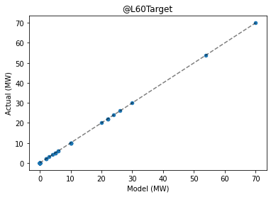

# Validating results

It is useful to know how well the Dispatch API approximates NEMDE outputs when presented with historical data. As NEMDE outputs are contained within the `NemSpdOutput` section of historical case files it is possible to backtest the Dispatch API's results against these data. 

The following sections discuss a feature of the Dispatch API that makes it easy to backtest results.

## Imports and authentication


```python
import os
import json

import requests
import pandas as pd
from dotenv import load_dotenv
import matplotlib.pyplot as plt

from jsonpath_ng import jsonpath
from jsonpath_ng.ext import parse

import IPython.display as display

# Load environment variables
load_dotenv()

# Replace with your API token
# E.g. TOKEN = 'd97f0be5-df17-4332-91d8-16c6bbca0b6d'
TOKEN = os.getenv('TOKEN')

# A valid API token must be included when making requests
headers = {'Authorization': f'Token {TOKEN}'}

# Base URL endpoint for the Dispatch API
# base_url = 'https://dispatch.envector.com/api/v1/'
base_url = 'http://dispatch.localhost/api/v1/'
```

## Submit validation job

In the pervious tutorials case files were submitted when creating jobs. Alternatively, the Dispatch API can be backtested against NEMDE by specifying a case ID, and including an option that will append the NEMDE solution to the results returned. This makes it easier to compare the solution returned by the Dispatch API with the 'actual' solution returned by NEMDE.

For example, if we sought to validate the model using data obtained from a case file with case ID `20201101001` the request body would be formulated as:

``` 
body = {
    "case_id": "20201101001",
    "options": {
        "solution_format": "validation"
    }
}
```

This instructs the Dispatch API to create a job using data from the specified case, and compares the results obtained with those found in the `NemSpdOutputs` section of the case file (i.e. the Dispatch API's results are compared against the solution obtained by NEMDE).


```python
def submit_validation_job(base_url, headers, case_id):
    """
    Validate Dispatch API results for a given case ID
    
    Parameters
    ----------
    base_url : str
        Base URL for the Dispatch API

    headers : dict
        Contains auth token used to authenticate requests
    
    case_id : str
        Case ID for which validation should be performed e.g. '20201101001'. 
        The format for case_id is as follows: {year}{month}{day}{interval_id} 
        where interval_id is in [001, ..., 288].
    
    Returns
    -------
    job_info : dict
        Response obtained from API when job is submitted. Includes the job's ID.
    """

    # Construct URL request body
    url = base_url + 'jobs/create'

    # Request body
    body = {
        'case_id': case_id,
        'options':
            {'solution_format': 'validation'}
    }

    # Make request
    headers = {'Authorization': f'Token {TOKEN}'}
    response = requests.post(url=url, headers=headers, json=body)
    
    # Information pertaining to the submitted job - includes job_id
    job_info = response.json()
    
    return job_info

# Submit validation job to the queue
job_info = submit_validation_job(base_url=base_url, headers=headers, case_id='20201101001')
job_info
```


    {'job_id': '4d0a835a-f91c-4db1-96cd-6587a5b8d720',
     'created_at': '2021-03-12T06:26:41.249334Z',
     'enqueued_at': '2021-03-12T06:26:41.249445Z',
     'timeout': 180,
     'status': 'queued',
     'label': None}


## Explore results

First, let's retrieve results from the queue.


```python
def get_job_results(base_url, headers, job_id):
    """Extract job results from the queue"""
    
    url = base_url + f'jobs/{job_id}/results'   
    response = requests.get(url=url, headers=headers)
    
    return response.json()


# Get job results from the queue
job_id = job_info.get('job_id')
job_results = get_job_results(base_url=base_url, headers=headers, job_id=job_id)
```

Pandas can be used to observe the difference between results obtained from the Dispatch API and results obtained from NEMDE. Results obtained from the Dispatch API are in the `model` column, while results corresponding to the NEMDE solution are in the column titled `actual`.

### Period solution
This component of the solution provides the value of the objective function, along with aggregate metrics pertaining to constraint violations.


```python
period_solution = job_results.get('results').get('output').get('PeriodSolution')

# Convert to markdown to display results
period_solution_md = pd.DataFrame(period_solution).to_markdown(index=False)
display.Markdown(period_solution_md)
```


|     case_id |   intervention | key                           |        model |       actual |
|------------:|---------------:|:------------------------------|-------------:|-------------:|
| 20201101001 |              0 | @TotalObjective               | -1.05408e+07 | -1.05408e+07 |
| 20201101001 |              0 | @TotalInterconnectorViolation |  0           |  0           |
| 20201101001 |              0 | @TotalGenericViolation        |  0           |  0           |
| 20201101001 |              0 | @TotalRampRateViolation       |  0           |  0           |
| 20201101001 |              0 | @TotalUnitMWCapacityViolation |  0           |  0           |
| 20201101001 |              0 | @TotalFastStartViolation      |  0           |  0           |
| 20201101001 |              0 | @TotalMNSPRampRateViolation   |  0           |  0           |
| 20201101001 |              0 | @TotalMNSPOfferViolation      |  0           |  0           |
| 20201101001 |              0 | @TotalMNSPCapacityViolation   |  0           |  0           |
| 20201101001 |              0 | @TotalUIGFViolation           |  0           |  0           |


### Region solution

Aggregate generation and load dispatched within each region, along with net power flow out of the region and the wholesale electricity price.


```python
region_solution = job_results.get('results').get('output').get('RegionSolution')

# Convert to markdown to display results
region_solution_md = (pd.DataFrame(region_solution).head(20)
                      .to_markdown(index=False))
display.Markdown(region_solution_md)
```


| region_id   |   intervention |     case_id | key                   |     model |    actual |
|:------------|---------------:|------------:|:----------------------|----------:|----------:|
| NSW1        |              0 | 20201101001 | @DispatchedGeneration | 5818.37   | 5818.37   |
| NSW1        |              0 | 20201101001 | @DispatchedLoad       |    0      |    0      |
| NSW1        |              0 | 20201101001 | @FixedDemand          | 5654.29   | 5654.29   |
| NSW1        |              0 | 20201101001 | @NetExport            |  164.078  |  164.08   |
| NSW1        |              0 | 20201101001 | @SurplusGeneration    |    0      |    0      |
| NSW1        |              0 | 20201101001 | @EnergyPrice          |   41.6999 |   41.6997 |
| NSW1        |              0 | 20201101001 | @R6Dispatch           |  213      |  213      |
| NSW1        |              0 | 20201101001 | @R60Dispatch          |  196      |  196      |
| NSW1        |              0 | 20201101001 | @R5Dispatch           |   68      |   52      |
| NSW1        |              0 | 20201101001 | @R5RegDispatch        |  118.172  |  118.17   |
| NSW1        |              0 | 20201101001 | @L6Dispatch           |  112.354  |  112.35   |
| NSW1        |              0 | 20201101001 | @L60Dispatch          |  173      |  173      |
| NSW1        |              0 | 20201101001 | @L5Dispatch           |   78.968  |   78.97   |
| NSW1        |              0 | 20201101001 | @L5RegDispatch        |   34      |   34      |
| NSW1        |              0 | 20201101001 | @ClearedDemand        | 5660.54   | 5660.54   |
| QLD1        |              0 | 20201101001 | @DispatchedGeneration | 5232.56   | 5232.56   |
| QLD1        |              0 | 20201101001 | @DispatchedLoad       |    0      |    0      |
| QLD1        |              0 | 20201101001 | @FixedDemand          | 5113.69   | 5113.69   |
| QLD1        |              0 | 20201101001 | @NetExport            |  118.868  |  118.87   |
| QLD1        |              0 | 20201101001 | @SurplusGeneration    |    0      |    0      |


### Trader solution
Dispatch targets for each trade type are reported. Ramp rates and fast start unit parameters are also included for some traders.


```python
trader_solution = job_results.get('results').get('output').get('TraderSolution')

# Convert to markdown to display results
trader_solution_md = (pd.DataFrame(trader_solution).head(20)
                      .to_markdown(index=False))
display.Markdown(trader_solution_md)
```


|     case_id |   intervention | trader_id   | key             |   model |   actual |
|------------:|---------------:|:------------|:----------------|--------:|---------:|
| 20201101001 |              0 | AGLHAL      | @R6Target       |       0 |        0 |
| 20201101001 |              0 | AGLHAL      | @R60Target      |       0 |        0 |
| 20201101001 |              0 | AGLHAL      | @R5Target       |       0 |        0 |
| 20201101001 |              0 | AGLHAL      | @R5RegTarget    |       0 |        0 |
| 20201101001 |              0 | AGLHAL      | @L6Target       |       0 |        0 |
| 20201101001 |              0 | AGLHAL      | @L60Target      |       0 |        0 |
| 20201101001 |              0 | AGLHAL      | @L5Target       |       0 |        0 |
| 20201101001 |              0 | AGLHAL      | @L5RegTarget    |       0 |        0 |
| 20201101001 |              0 | AGLHAL      | @R6Violation    |       0 |        0 |
| 20201101001 |              0 | AGLHAL      | @R60Violation   |       0 |        0 |
| 20201101001 |              0 | AGLHAL      | @R5Violation    |       0 |        0 |
| 20201101001 |              0 | AGLHAL      | @R5RegViolation |       0 |        0 |
| 20201101001 |              0 | AGLHAL      | @L6Violation    |       0 |        0 |
| 20201101001 |              0 | AGLHAL      | @L60Violation   |       0 |        0 |
| 20201101001 |              0 | AGLHAL      | @L5Violation    |       0 |        0 |
| 20201101001 |              0 | AGLHAL      | @L5RegViolation |       0 |        0 |
| 20201101001 |              0 | AGLHAL      | @EnergyTarget   |       0 |        0 |
| 20201101001 |              0 | AGLHAL      | @RampUpRate     |     720 |      720 |
| 20201101001 |              0 | AGLHAL      | @RampDnRate     |     720 |      720 |
| 20201101001 |              0 | AGLHAL      | @FSTargetMode   |       0 |        0 |


### Interconnector solution

Power flow over each interconnector along with its associated losses are reported. The amount by which power flow constraints are violated is given by the value corresponding to the `@Deficit` key.


```python
interconnector_solution = (job_results.get('results').get('output')
                           .get('InterconnectorSolution'))

# Convert to markdown to display results
interconnector_solution_md = (pd.DataFrame(interconnector_solution).head(20)
                              .to_markdown(index=False))
display.Markdown(interconnector_solution_md)
```


| interconnector_id   |     case_id |   intervention | key      |       model |     actual |
|:--------------------|------------:|---------------:|:---------|------------:|-----------:|
| N-Q-MNSP1           | 20201101001 |              0 | @Flow    |  -33        |  -33       |
| N-Q-MNSP1           | 20201101001 |              0 | @Losses  |   -0.591673 |   -0.59167 |
| N-Q-MNSP1           | 20201101001 |              0 | @Deficit |    0        |    0       |
| NSW1-QLD1           | 20201101001 |              0 | @Flow    |  -86.0011   |  -86.0011  |
| NSW1-QLD1           | 20201101001 |              0 | @Losses  |    0.306671 |    0.30667 |
| NSW1-QLD1           | 20201101001 |              0 | @Deficit |    0        |    0       |
| T-V-MNSP1           | 20201101001 |              0 | @Flow    | -222.507    | -222.507   |
| T-V-MNSP1           | 20201101001 |              0 | @Losses  |    6.01955  |    6.01955 |
| T-V-MNSP1           | 20201101001 |              0 | @Deficit |    0        |    0       |
| V-S-MNSP1           | 20201101001 |              0 | @Flow    |   45        |   45       |
| V-S-MNSP1           | 20201101001 |              0 | @Losses  |   -0.856901 |   -0.8569  |
| V-S-MNSP1           | 20201101001 |              0 | @Deficit |    0        |    0       |
| V-SA                | 20201101001 |              0 | @Flow    |   50        |   50       |
| V-SA                | 20201101001 |              0 | @Losses  |    0.60394  |    0.60394 |
| V-SA                | 20201101001 |              0 | @Deficit |    0        |    0       |
| VIC1-NSW1           | 20201101001 |              0 | @Flow    | -276.834    | -276.834   |
| VIC1-NSW1           | 20201101001 |              0 | @Losses  |   10.8428   |   10.8428  |
| VIC1-NSW1           | 20201101001 |              0 | @Deficit |    0        |    0       |


### Constraint solution
The right-hand side (RHS) value of each constraint along with the amount by which it is violated, given by `@Deficit`, is reported in the constraint solution.

<span style="color:red">The Dispatch API obtains generic constraint RHS values from the `NemSpdOutputs` section of a case file when formulating the mathematical program to be solved. **This is a limitation of the Dispatch API**. Please the see the [caveats section](/caveats) for more details. Consequently, there will be no difference between `model` and `actual` `@RHS` values for all constraints. However, the `@Deficit` attribute is obtained from the Dispatch API's solution, so differences may be observed for this key.
</span>


```python
constraint_solution = (job_results.get('results').get('output')
                       .get('ConstraintSolution'))

# Convert to markdown to display results
constraint_solution_md = (pd.DataFrame(constraint_solution)
                          .head().to_markdown(index=False))
display.Markdown(constraint_solution_md)
```


|     case_id |   intervention | constraint_id   | key      |   model |   actual |
|------------:|---------------:|:----------------|:---------|--------:|---------:|
| 20201101001 |              0 | #BBTHREE3_E     | @RHS     |      25 |       25 |
| 20201101001 |              0 | #BBTHREE3_E     | @Deficit |       0 |        0 |
| 20201101001 |              0 | #BULGANA1_E     | @RHS     |     100 |      100 |
| 20201101001 |              0 | #BULGANA1_E     | @Deficit |       0 |        0 |
| 20201101001 |              0 | #COOPGWF1_E     | @RHS     |     329 |      329 |


## Evaluating the Dispatch API
Let's use a few plots to see how dispatch targets obtained from the Dispatch API compare with results outputted by NEMDE.


```python
def plot_solution(solution, key):
    """Plot 'model' vs 'actual' solution for a given key"""
    
    # Convert to DataFrame
    df = pd.DataFrame(solution)
    
    # Initialise figure
    fig, ax = plt.subplots()

    # Plot results for a given key
    ax = df.loc[df['key'] == key, :].plot.scatter(ax=ax, x='model', y='actual')

    # Plot line with slope = 1
    min_value = df.loc[df['key'] == key, ['model', 'actual']].min().min()
    max_value = df.loc[df['key'] == key, ['model', 'actual']].max().max()
    line_style = {'color': 'k', 'linestyle': '--', 'alpha': 0.5}
    ax.plot([min_value, max_value], [min_value, max_value], **line_style)
    
    # Set title
    ax.set_title(key)
    ax.set_xlabel('Model (MW)')
    ax.set_ylabel('Actual (MW)')
    
    plt.show()

    
# Check the @EnergyTarget solution for all traders
plot_solution(solution=trader_solution, key='@EnergyTarget')
```


    

    


Each point corresponds to a trader. The horizontal axis corresponds to the target output level obtained from the Dispatch API, while the vertical axis shows targets produced by NEMDE. The dashed line has a slope equal to one, indicating the region over which the Dispatch API's solution equals the NEMDE solution. Points close to the dashed line indicate close correspondence between the Dispatch API's solution and the solution obtained by NEMDE.

Plots can be constructed for the remaining trade types:


```python
keys = ['@R6Target', '@R60Target', '@R5Target', '@R5RegTarget',
        '@L6Target', '@L60Target', '@L5Target', '@L5RegTarget']

for i in keys:
    plot_solution(solution=trader_solution, key=i)
```


    

    


    

    


    

    


    

    


    

    


    

    


    

    


    

    


### Objective function value
The value of the objective function at optimality provides a useful heuristic when comparing the solution obtained from the Dispatch API with the results outputted by NEMDE. Small perturbations to input parameters or constraint formulations can manifest as large differences in the objective function's value. It's unlikely there would be close correspondence between these values if the Dispatch API's formulation was a manifestly innaccurate approximation of NEMDE. 

Let's examine the objective function values:


```python
# objective = period_solution.loc['@TotalObjective']
objective = [i for i in period_solution if i.get('key') == '@TotalObjective'][0]
objective
```


    {'case_id': '20201101001',
     'intervention': '0',
     'key': '@TotalObjective',
     'model': -10540805.66769616,
     'actual': -10540790.07213}


We can also compute the absolute and relative difference.


```python
difference = objective.get('model') - objective.get('actual')
relative_difference = difference / objective.get('actual')

print("Difference:", difference)
print("Relative difference:", relative_difference)
```

    Difference: -15.595566159114242
    Relative difference: 1.4795443275498999e-06


The relative difference is very small at approximately `0.000148`%. At this level solver settings, such as tolerances, and floating point precision could be coming into play.

## Summary
This notebook examined strategies that can be used to validate model outputs. Reasons for discrepancies between the Dispatch API's solution and results obtained from NEMDE were also discussed, including features of the NEMDE's mathematical formulation that may result in non-unique solutions being returned. 

Without the ability to examine the mathematical forumulation used by NEMDE definitive model validation is impossible. Instead, we must adopt a data-driven approach when evaluating the Dispatch API's performance. The [model validation section](/model-validation) extends the analysis presented above by comparing dispatch outcomes over thousands of dispatch intervals. This process of experimentation and followed by diagnostic analysis helps identify areas in which the Dispatch API's model formulation can be improved.
